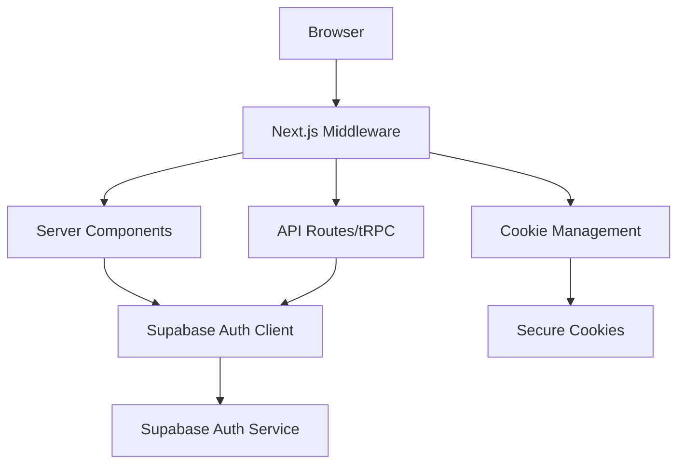

# PRD (Product Requirements Document)

## 1. Introduction

**Overview:** Replace the current better-auth authentication system with Supabase Authentication, providing a more integrated auth solution that leverages the existing Supabase database infrastructure. The new system will feature shadcn/ui-styled authentication components for a modern, consistent user interface.

**Context:** The project currently uses better-auth with a custom authentication implementation. Since the database is already hosted on Supabase, migrating to Supabase Auth will simplify the architecture, reduce maintenance overhead, and provide better integration with other Supabase services.

**Scope:**

- ✅ **Includes:** 
  - Complete removal of better-auth package and related code
  - Implementation of Supabase Auth with @supabase/ssr for Next.js
  - shadcn/ui-styled authentication UI components (login, signup, password reset)
  - Email/password, Google OAuth, and Facebook OAuth authentication
  - Session management with cookies for SSR compatibility
  - Integration with existing tRPC API layer
  - Middleware for automatic token refresh

- ❌ **Excludes:** 
  - Additional OAuth providers (beyond Google and Facebook)
  - Multi-factor authentication (MFA)
  - Phone authentication
  - Magic link authentication
  - User profile management UI
  - Email verification customization

**Success Metrics:**

- Zero authentication-related errors after migration
- Seamless user experience with no required re-authentication
- Improved page load performance with server-side auth
- 100% compatibility with existing tRPC protected procedures

## 2. Core Features

### Feature 1: Supabase Authentication Integration

- **What it does:** Implements Supabase Auth as the primary authentication provider, replacing better-auth
- **Why it's important:** Leverages existing Supabase infrastructure, reduces complexity, and provides better integration
- **How it works:** Uses @supabase/ssr package for cookie-based authentication with server-side rendering support

### Feature 2: shadcn/ui Authentication UI

- **What it does:** Provides beautiful, accessible authentication forms styled with shadcn/ui design system
- **Why it's important:** Ensures consistent design language across the application and improves user experience
- **How it works:** Custom-built forms using shadcn/ui components with react-hook-form and Zod validation

### Feature 3: Server-Side Authentication

- **What it does:** Enables authentication state to be available during server-side rendering
- **Why it's important:** Improves performance, SEO, and prevents authentication flicker on page load
- **How it works:** Stores auth tokens in secure cookies that are accessible by both client and server

## 3. User Experience

### 3.1 User Personas

| Persona | Description | Goals | Pain Points |
| --- | --- | --- | --- |
| New User | First-time visitor wanting to sign up | Quick, simple registration process | Complex forms, unclear requirements |
| Returning User | Existing user logging back in | Fast, secure login | Forgotten passwords, session expiry |
| Developer | Team member integrating auth | Easy API integration, clear docs | Complex auth flows, poor DX |

### 3.2 Key User Flows

**Flow 1: User Registration**

1. User navigates to /auth/signup
2. System displays signup form with email, password fields
3. User enters credentials and submits
4. System creates account, sends verification email
5. User is redirected to dashboard (or verification pending page)

**Flow 2: User Login**

1. User navigates to /auth/login
2. System displays login form with email/password or social options
3. User chooses authentication method
4. System validates credentials
5. User is redirected to intended page or dashboard

**Flow 3: Password Reset**

1. User clicks "Forgot password?" on login page
2. System displays password reset form
3. User enters email address
4. System sends password reset email
5. User clicks link and sets new password

### 3.3 UI/UX Considerations

- **Design Principles:** Mobile-first, accessibility-first, consistent with shadcn/ui
- **Key Screens:** Login page, Signup page, Password reset page, Auth callback page
- **Interaction Patterns:** Form validation on blur, loading states, error handling

## 4. Requirements

### 4.1 Functional Requirements

#### FR1: Authentication Methods

**Story:** As a user, I want multiple ways to authenticate, so that I can choose my preferred method

**Acceptance:**
- WHEN user visits login page THEN system SHALL display email/password and social OAuth options (Google, Facebook)
- WHEN user enters valid email/password THEN system SHALL authenticate and create session
- WHEN user clicks Google login THEN system SHALL redirect to Google OAuth flow
- WHEN user clicks Facebook login THEN system SHALL redirect to Facebook OAuth flow
- WHEN OAuth callback succeeds THEN system SHALL create session and redirect to app

#### FR2: Session Management

**Story:** As a user, I want my session to persist across page refreshes, so that I don't have to log in repeatedly

**Acceptance:**
- WHEN user successfully authenticates THEN system SHALL store session in secure cookies
- WHEN user navigates between pages THEN system SHALL maintain authentication state
- WHEN session expires THEN system SHALL automatically attempt token refresh
- IF refresh fails THEN system SHALL redirect user to login page

#### FR3: Server-Side Authentication

**Story:** As a developer, I want authentication available on the server, so that I can protect pages and API routes

**Acceptance:**
- WHEN server renders a page THEN system SHALL have access to user session
- WHEN tRPC procedure requires auth THEN system SHALL validate session from cookies
- WHEN middleware runs THEN system SHALL refresh expired tokens automatically
- IF user is not authenticated THEN system SHALL return appropriate error

#### FR4: Authentication UI

**Story:** As a user, I want a clean, modern authentication interface, so that I feel confident using the app

**Acceptance:**
- WHEN user views auth pages THEN system SHALL display shadcn/ui styled forms
- WHEN user enters invalid data THEN system SHALL show inline validation errors
- WHEN form is submitting THEN system SHALL show loading state
- WHEN authentication fails THEN system SHALL display clear error messages

### 4.2 Non-Functional Requirements

**Performance**
- Response time: <200ms for auth state checks
- Token refresh: <500ms for automatic refresh
- Page load: No authentication flicker on SSR pages

**Security**
- Authentication: Supabase Auth with secure defaults
- Token storage: HttpOnly, Secure, SameSite cookies
- Password requirements: Minimum 8 characters
- Session management: Automatic expiry and refresh

**Reliability**
- Availability: 99.9% uptime (depends on Supabase)
- Fault tolerance: Graceful handling of auth service errors
- Recovery: Automatic retry for transient failures

**Usability**
- UX: Mobile-responsive authentication forms
- Accessibility: WCAG 2.1 AA compliant
- Documentation: Clear integration guide for developers

## 5. Technical Design

### 5.1 Architecture

The authentication system follows a cookie-based approach for server-side rendering compatibility:



**Patterns:** 
- Server-side authentication with cookies
- Middleware-based token refresh
- Separate clients for server/client components

**Key Decisions:** 
- Cookie-based sessions over localStorage for SSR
- PKCE flow for secure token exchange
- Middleware pattern for automatic token refresh

### 5.2 Components and Interfaces

| Component | Purpose | Interface | Dependencies |
| --- | --- | --- | --- |
| createClient (Server) | Server-side Supabase client | `createClient(cookies: ReadonlyRequestCookies)` | @supabase/ssr |
| createClient (Browser) | Client-side Supabase client | `createClient()` | @supabase/ssr |
| middleware | Token refresh & cookie management | `middleware(request: NextRequest)` | Next.js middleware |
| AuthProvider | Client-side auth context | `<AuthProvider>{children}</AuthProvider>` | React Context |

**Detailed Interfaces:**

```typescript
// Server client utility
export function createServerClient() {
  const cookieStore = cookies()
  return createClient(
    process.env.NEXT_PUBLIC_SUPABASE_URL!,
    process.env.NEXT_PUBLIC_SUPABASE_ANON_KEY!,
    {
      cookies: {
        getAll: () => cookieStore.getAll(),
        setAll: (cookiesToSet) => {
          // Implementation
        }
      }
    }
  )
}

// tRPC Context
interface TRPCContext {
  supabase: SupabaseClient
  session: Session | null
  user: User | null
}
```

### 5.3 Data Models

```typescript
// Using Supabase's built-in auth schema
interface User {
  id: string
  email: string
  email_confirmed_at: string | null
  phone: string | null
  confirmed_at: string | null
  last_sign_in_at: string | null
  app_metadata: Record<string, any>
  user_metadata: Record<string, any>
  created_at: string
  updated_at: string
}

interface Session {
  access_token: string
  token_type: string
  expires_in: number
  expires_at: number
  refresh_token: string
  user: User
}
```

### 5.4 API Design

| Endpoint | Method | Path | Purpose |
| --- | --- | --- | --- |
| Login | POST | `/auth/v1/token?grant_type=password` | Email/password login |
| Signup | POST | `/auth/v1/signup` | Create new account |
| OAuth | GET | `/auth/v1/authorize` | Initiate OAuth flow |
| Refresh | POST | `/auth/v1/token?grant_type=refresh_token` | Refresh session |
| Logout | POST | `/auth/v1/logout` | End session |

### 5.5 Database Design

**Tables:** Uses Supabase's built-in auth schema (auth.users, auth.sessions, auth.identities)

**Key Indexes:** Automatically managed by Supabase

**Constraints:** Built-in email uniqueness, identity provider constraints

### 5.6 Error Handling

| Error | When It Occurs | User Impact | Recovery Strategy |
| --- | --- | --- | --- |
| Invalid credentials | Wrong email/password | Cannot log in | Show error, allow retry |
| Session expired | Token lifetime exceeded | Logged out unexpectedly | Auto-refresh or re-login |
| Network error | API unreachable | Cannot authenticate | Retry with exponential backoff |
| OAuth error | Provider issue | Cannot use social login | Fallback to email/password |

**Error Response Format:**

```json
{
  "error": "invalid_credentials",
  "error_description": "Invalid login credentials",
  "error_code": "invalid_credentials"
}
```

## 6. Testing Strategy

**Unit Testing**
- Coverage target: 80%
- Focus areas: Auth utilities, form validation, error handling

**Integration Testing**
- Key flows: Login, signup, OAuth callback, token refresh
- Mock strategy: Mock Supabase client for predictable testing

**E2E Testing**
- Critical paths: Complete auth flows, protected page access
- Performance: Measure auth check latency, token refresh time

## 7. Implementation Considerations

**Dependencies**
- External: @supabase/supabase-js, @supabase/ssr
- Internal: Existing UI components from @goat/ui
- To remove: better-auth, @better-auth/expo

**Migration & Deployment**
- Data migration: Map better-auth users to Supabase auth.users
- Backward compatibility: Temporary dual auth support during migration
- Rollback plan: Feature flag to switch between auth systems
- Feature flags: `USE_SUPABASE_AUTH` environment variable
- OAuth setup: Configure Google and Facebook OAuth apps in their respective developer consoles
- Environment variables: 
  - `SUPABASE_AUTH_EXTERNAL_GOOGLE_CLIENT_ID`
  - `SUPABASE_AUTH_EXTERNAL_GOOGLE_SECRET`
  - `SUPABASE_AUTH_EXTERNAL_FACEBOOK_CLIENT_ID`
  - `SUPABASE_AUTH_EXTERNAL_FACEBOOK_SECRET`

**Security Considerations**
- Authentication: Supabase Auth with secure defaults
- Session storage: Secure, HttpOnly, SameSite cookies
- CSRF protection: Built into Supabase Auth
- Rate limiting: Supabase's built-in rate limits
- OAuth configuration: Secure OAuth app setup in Google Cloud Console and Facebook Developer Portal

**Performance Optimization**
- Caching: Browser caches valid sessions
- Token refresh: Automatic refresh before expiry
- SSR: No client-side auth checks on initial load

## 8. Risks and Mitigations

| Risk | Probability | Impact | Mitigation Strategy |
| --- | --- | --- | --- |
| User session loss during migration | Medium | High | Implement careful migration with user mapping |
| OAuth provider compatibility | Low | Medium | Test Google and Facebook OAuth thoroughly before deployment |
| Performance regression | Low | Medium | Benchmark auth operations before/after |
| Breaking tRPC integration | Medium | High | Extensive testing of protected procedures |

## 9. Future Enhancements

- **Multi-factor authentication**: Add TOTP/SMS 2FA support
- **Additional OAuth providers**: Discord, GitHub, Apple, Twitter sign-in
- **Magic link authentication**: Passwordless email login
- **Advanced session management**: Device tracking, session revocation
- **User impersonation**: Admin ability to act as users for support

## 10. Appendix

### 10.1 Glossary

**Terms:**
- **SSR**: Server-Side Rendering
- **PKCE**: Proof Key for Code Exchange
- **JWT**: JSON Web Token
- **OAuth**: Open Authorization protocol

### 10.2 Research Findings

- **Supabase Auth**: Provides robust, battle-tested authentication
- **Cookie-based auth**: Required for Next.js App Router SSR
- **shadcn/ui**: Offers pre-built, customizable auth form patterns

### 10.3 References

- [Supabase Auth Documentation](https://supabase.com/docs/guides/auth)
- [Next.js Server-Side Auth Guide](https://supabase.com/docs/guides/auth/server-side/nextjs)
- [Supabase Google OAuth Setup](https://supabase.com/docs/guides/auth/social-login/auth-google)
- [Supabase Facebook OAuth Setup](https://supabase.com/docs/guides/auth/social-login/auth-facebook)
- [shadcn/ui Form Components](https://ui.shadcn.com/docs/components/form)
- [Current better-auth implementation](packages/auth/src/index.ts:1-48)