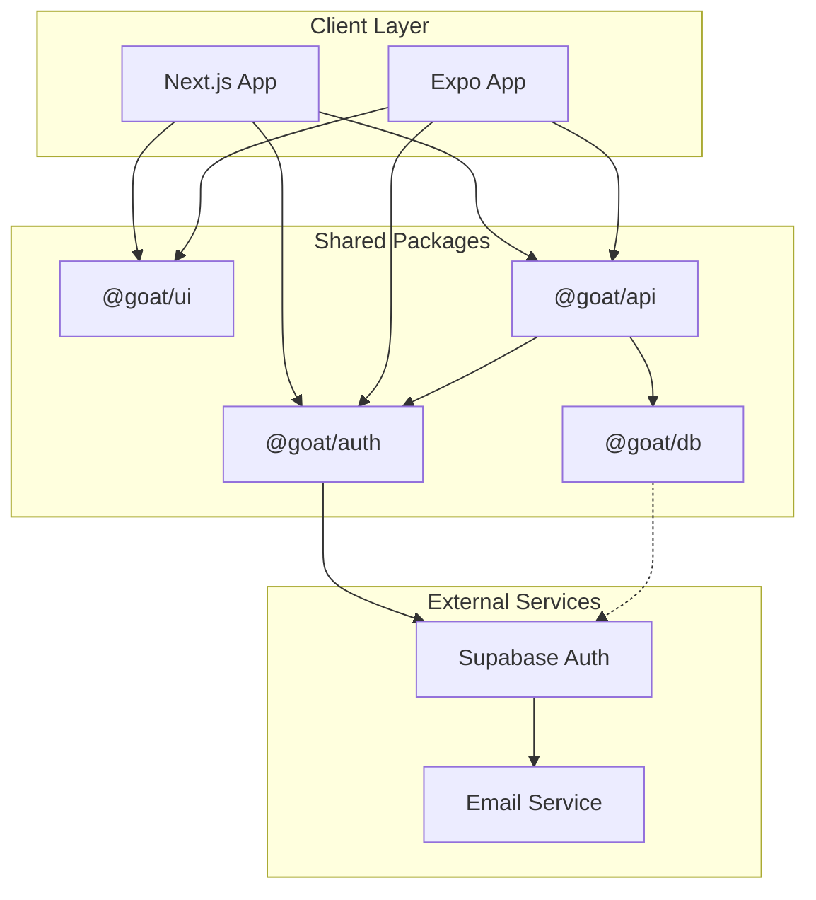
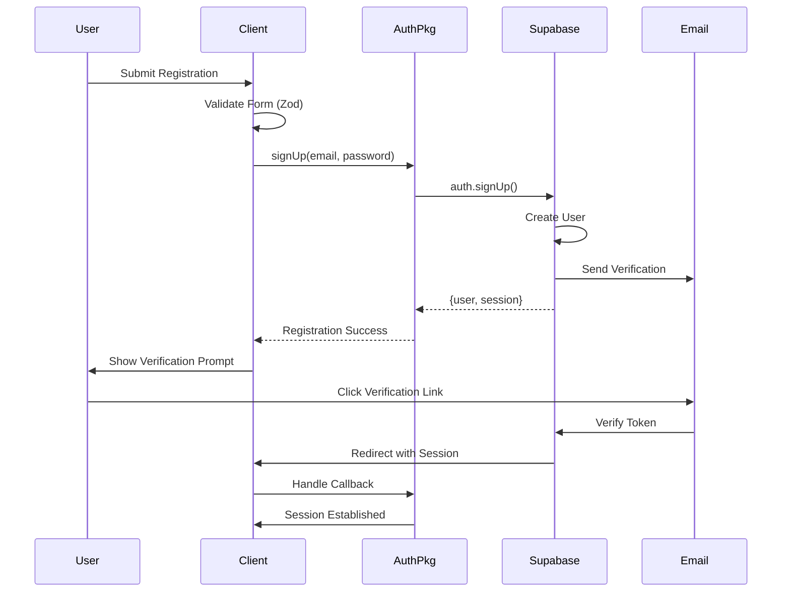

# Design Document - User Registration with Supabase Authentication

## Overview

This design implements a comprehensive user registration system by migrating from Better Auth to Supabase Authentication. Since this is a new system using a boilerplate codebase, we will completely replace Better Auth without needing data migration. The implementation leverages existing UI components, patterns, and architecture while introducing Supabase as the centralized authentication provider. The system will support email/password registration with verification, seamless integration across web (Next.js) and mobile (Expo) platforms.

### Key Design Goals

1. **Clean Implementation**: Fresh Supabase setup without legacy concerns
2. **Code Reuse**: Maximize use of existing UI components and utilities from the boilerplate
3. **Type Safety**: Maintain TypeScript type safety throughout the auth flow
4. **Platform Parity**: Ensure consistent experience across web and mobile
5. **Modern Architecture**: Implement current best practices with Supabase

## Code Reuse Analysis

### Components to Leverage

- **UI Components** (@goat/ui): Button, Form, Input, Label, Toast - all shadcn components ready for auth forms
- **Form System**: Existing React Hook Form + Zod validation infrastructure
- **tRPC Setup**: Context and procedure patterns for API integration
- **Environment Management**: @t3-oss/env for validated configuration
- **Mobile Storage**: Expo SecureStore implementation for session persistence
- **Server Actions**: Existing patterns in AuthShowcase component

### Components to Replace

- **@better-auth/core**: Replaced by @supabase/supabase-js
- **Auth Schema**: Migrate to Supabase's auth.users table
- **Session Management**: Use Supabase session handling
- **Auth Routes**: Adapt to Supabase Auth Helpers

### New Components Required

- **Supabase Client**: Centralized client initialization
- **Registration Form**: Enhanced with password strength and validation
- **Email Verification**: New verification flow UI
- **Migration Utilities**: Tools for existing user migration

## Architecture

The architecture maintains the existing monorepo structure while introducing Supabase as the authentication layer. The design preserves the separation of concerns across packages while centralizing auth logic.



### Authentication Flow



## Components and Interfaces

### 1. Supabase Auth Package (@goat/auth)

- **Purpose:** Centralized authentication logic and Supabase client management
- **Interfaces:**

  ```typescript
  // Client initialization
  export function createAuthClient(options?: AuthOptions): SupabaseClient;

  // Registration
  export async function signUp(
    email: string,
    password: string,
  ): Promise<AuthResponse>;

  // Session management
  export function useSession(): { session: Session | null; loading: boolean };
  export async function getSession(): Promise<Session | null>;

  // Email verification
  export async function verifyEmail(token: string): Promise<void>;
  export async function resendVerification(email: string): Promise<void>;
  ```

- **Dependencies:** @supabase/supabase-js, @t3-oss/env-nextjs

### 2. Registration Form Component

- **Purpose:** Reusable registration form with validation and error handling
- **Interfaces:**
  ```typescript
  interface RegistrationFormProps {
    onSuccess?: (user: User) => void;
    onError?: (error: AuthError) => void;
    redirectTo?: string;
  }
  ```
- **Dependencies:** @goat/ui components, react-hook-form, zod

### 3. tRPC Auth Router Enhancement

- **Purpose:** Server-side auth operations and protected procedures
- **Interfaces:**
  ```typescript
  // Enhanced auth router
  auth.register: publicProcedure.input(registerSchema).mutation()
  auth.verifyEmail: publicProcedure.input(z.string()).mutation()
  auth.resendVerification: protectedProcedure.mutation()
  auth.getSession: publicProcedure.query()
  ```
- **Dependencies:** @goat/auth, @trpc/server

### 4. Mobile Auth Integration

- **Purpose:** Native mobile authentication with secure storage
- **Interfaces:**

  ```typescript
  // Expo-specific auth client
  export function createExpoAuthClient(): SupabaseClient;

  // Secure session storage
  export const sessionStore: {
    getSession(): Promise<Session | null>;
    setSession(session: Session): Promise<void>;
    clearSession(): Promise<void>;
  };
  ```

- **Dependencies:** @supabase/supabase-js, expo-secure-store, expo-web-browser

### 5. Environment Configuration

- **Purpose:** Manage Supabase environment variables and configuration
- **Interfaces:**

  ```typescript
  // Environment schema extension
  export const supabaseEnv = createEnv({
    server: {
      SUPABASE_URL: z.string().url(),
      SUPABASE_ANON_KEY: z.string(),
      SUPABASE_SERVICE_KEY: z.string().optional(),
    },
    client: {
      NEXT_PUBLIC_SUPABASE_URL: z.string().url(),
      NEXT_PUBLIC_SUPABASE_ANON_KEY: z.string(),
    },
  });
  ```

- **Dependencies:** @t3-oss/env-nextjs, zod

## Data Models

### User Model (Supabase auth.users)

```typescript
interface SupabaseUser {
  id: string; // UUID
  email: string;
  email_confirmed_at: string | null;
  created_at: string;
  updated_at: string;
  last_sign_in_at: string | null;
  app_metadata: {
    provider?: string;
    providers?: string[];
  };
  user_metadata: {
    name?: string;
    avatar_url?: string;
  };
}
```

### Profile Model (Extended User Data)

```typescript
interface UserProfile {
  id: string; // References auth.users.id
  name: string | null;
  avatar_url: string | null;
  created_at: Date;
  updated_at: Date;
}
```

### Session Model (Handled by Supabase)

```typescript
interface Session {
  access_token: string;
  refresh_token: string;
  expires_in: number;
  expires_at: number;
  user: SupabaseUser;
}
```

### Registration Validation Schema

```typescript
// Enhanced validation with password strength
import { z } from "zod";

export const passwordSchema = z.string()
  .min(8, "Password must be at least 8 characters")
  .regex(/[A-Z]/, "Must contain uppercase letter")
  .regex(/[a-z]/, "Must contain lowercase letter")
  .regex(/[0-9]/, "Must contain number")
  .regex(/[^A-Za-z0-9]/, "Must contain special character");

export const registerSchema = z.object({
  email: z.string().email("Invalid email address"),
  password: passwordSchema,
  confirmPassword: z.string(),
}).refine((data) => data.password === data.confirmPassword, {
  message: "Passwords do not match",
  path: ["confirmPassword"],
});
```

## Error Handling

### Registration Errors

1. **Email Already Exists**
   - **Handling:** Return user-friendly error message
   - **User Impact:** Toast notification: "An account with this email already exists. Please sign in instead."

2. **Weak Password**
   - **Handling:** Client-side validation with real-time feedback
   - **User Impact:** Inline error: "Password must be at least 8 characters with 1 uppercase, 1 lowercase, 1 number"

3. **Network Failure**
   - **Handling:** Exponential backoff retry (3 attempts)
   - **User Impact:** Loading state with option to retry manually

4. **Rate Limiting**
   - **Handling:** Track attempts in Redis/memory, show cooldown
   - **User Impact:** "Too many attempts. Please try again in X minutes."

### Verification Errors

1. **Invalid/Expired Token**
   - **Handling:** Show error with resend option
   - **User Impact:** "This verification link has expired. Click here to send a new one."

2. **Already Verified**
   - **Handling:** Redirect to login/dashboard
   - **User Impact:** "Your email is already verified. Redirecting to login..."

### Session Errors

1. **Expired Session**
   - **Handling:** Attempt refresh, fallback to re-auth
   - **User Impact:** Seamless refresh or login prompt

2. **Invalid Token**
   - **Handling:** Clear storage and redirect to login
   - **User Impact:** "Your session has expired. Please sign in again."

## Testing Strategy

### Unit Testing

- **Auth Package Functions**
  - Test Supabase client initialization with various configs
  - Mock Supabase responses for registration flows
  - Validate error handling for all edge cases
- **Form Validation**
  - Test Zod schemas for all input scenarios
  - Validate password strength algorithm
  - Test form state management

- **Utilities**
  - Test migration scripts with mock data
  - Validate session storage operations
  - Test environment variable validation

### Integration Testing

- **Registration Flow**
  - Test complete registration from form to verification
  - Validate tRPC mutations with real Supabase instance
  - Test session establishment post-registration

- **Cross-Platform Compatibility**
  - Test web registration with various browsers
  - Test mobile registration on iOS/Android
  - Validate deep link handling for verification

- **Configuration Testing**
  - Test environment variable validation
  - Validate Supabase client initialization
  - Test connection error handling

### End-to-End Testing

- **User Journeys**
  - New user registration → verification → first login
  - Registration with existing email → error → login redirect
  - Mobile registration → background → resume → verify
- **Error Scenarios**
  - Network failure during registration
  - Email service downtime handling
  - Concurrent registration attempts

- **Performance Testing**
  - Load test registration endpoint (target: < 2s response)
  - Test form validation performance (target: < 100ms)
  - Measure email delivery time (target: < 60s)

## Security Considerations

1. **Password Security**
   - Enforce strong password policy at Supabase level
   - Never log or store passwords in plain text
   - Use Supabase's built-in bcrypt hashing

2. **Token Management**
   - Store tokens in httpOnly cookies (web) and SecureStore (mobile)
   - Implement proper token rotation
   - Clear tokens on logout across all platforms

3. **Rate Limiting**
   - Implement at API Gateway level
   - Track by IP and email
   - Progressive delays for repeated failures

4. **CAPTCHA Integration**
   - Add reCAPTCHA v3 for suspicious activity
   - Trigger after 3 failed attempts
   - Implement invisible CAPTCHA for better UX

## Implementation Plan

1. **Phase 1: Setup**
   - Configure Supabase project and environment variables
   - Remove Better Auth dependencies
   - Setup Supabase client initialization

2. **Phase 2: Core Features**
   - Implement registration form with validation
   - Create tRPC auth procedures
   - Setup email verification flow

3. **Phase 3: Integration**
   - Integrate with existing UI components
   - Update session management
   - Deploy and test across platforms

## Performance Optimizations

1. **Client-Side**
   - Lazy load registration form components
   - Implement optimistic UI updates
   - Cache validation schemas

2. **Server-Side**
   - Use Supabase connection pooling
   - Implement Redis session cache
   - Optimize database queries

3. **Mobile-Specific**
   - Preload auth screens
   - Queue operations when offline
   - Minimize secure storage operations
