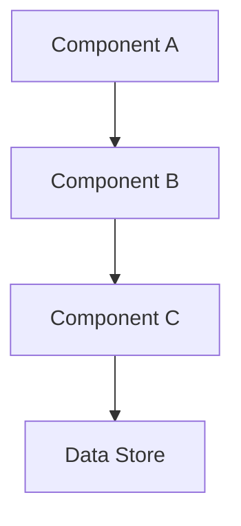

# Unified Specification Template

## 1. Introduction

**Overview:** [Brief description of the feature, its purpose, and its value to users]

**Context:** [How this feature fits into the overall system and product strategy]

**Scope:**

- ✅ **Includes:** [What will be delivered]
- ❌ **Excludes:** [What will NOT be delivered]

**Success Metrics:**

- [Quantifiable metric 1]
- [Quantifiable metric 2]
- [Business/user impact metric]

## 2. Core Features

### Feature 1: [Feature Name]

- **What it does:** [Clear description of functionality]
- **Why it's important:** [Business/user value]
- **How it works:** [High-level explanation]

### Feature 2: [Feature Name]

- **What it does:** [Clear description of functionality]
- **Why it's important:** [Business/user value]
- **How it works:** [High-level explanation]

### Feature 3: [Feature Name]

- **What it does:** [Clear description of functionality]
- **Why it's important:** [Business/user value]
- **How it works:** [High-level explanation]

## 3. User Experience

### 3.1 User Personas

| Persona          | Description              | Goals                       | Pain Points            |
| ---------------- | ------------------------ | --------------------------- | ---------------------- |
| [Primary User]   | [Demographics & context] | [What they want to achieve] | [Current frustrations] |
| [Secondary User] | [Demographics & context] | [What they want to achieve] | [Current frustrations] |

### 3.2 Key User Flows

**Flow 1: [Primary Flow Name]**

1. User [action]
2. System [response]
3. User [next action]
4. System [completion]

**Flow 2: [Secondary Flow Name]**

1. User [action]
2. System [response]
3. User [completion]

### 3.3 UI/UX Considerations

- **Design Principles:** [e.g., Mobile-first, Accessibility-first]
- **Key Screens:** [List critical interfaces]
- **Interaction Patterns:** [e.g., Drag-drop, Single-page app]

## 4. Requirements

### 4.1 Functional Requirements

#### FR1: [Requirement Name]

**Story:** As a [role], I want [feature], so that [benefit]
**Acceptance:**

- WHEN [event] THEN [system] SHALL [response]
- IF [precondition] THEN [system] SHALL [response]
- WHEN [event] AND [condition] THEN [system] SHALL [response]

#### FR2: [Requirement Name]

**Story:** As a [role], I want [feature], so that [benefit]
**Acceptance:**

- WHEN [event] THEN [system] SHALL [response]
- IF [precondition] THEN [system] SHALL [response]

### 4.2 Non-Functional Requirements

**Performance**

- Response time: [e.g., <200ms for API calls]
- Throughput: [e.g., 1000 requests/second]
- Resource usage: [e.g., <2GB memory]

**Security**

- Authentication: [e.g., OAuth 2.0]
- Authorization: [e.g., Role-based access]
- Data protection: [e.g., Encryption at rest]

**Reliability**

- Availability: [e.g., 99.9% uptime]
- Fault tolerance: [e.g., Graceful degradation]
- Recovery: [e.g., <1 hour RTO]

**Usability**

- UX: [e.g., Mobile-responsive]
- Accessibility: [e.g., WCAG 2.1 AA]
- Documentation: [e.g., API docs, user guide]

## 5. Technical Design

### 5.1 Architecture

[Describe the overall architecture, design patterns, and key architectural decisions]



**Patterns:** [e.g., Repository pattern, Observer pattern, Factory pattern]  
**Key Decisions:** [e.g., REST vs GraphQL, sync vs async processing]

### 5.2 Components and Interfaces

| Component     | Purpose        | Interface                           | Dependencies   |
| ------------- | -------------- | ----------------------------------- | -------------- |
| [Component 1] | [What it does] | `interface Name { method(): Type }` | [Dependencies] |
| [Component 2] | [What it does] | `interface Name { method(): Type }` | [Dependencies] |

**Detailed Interfaces:**

```typescript
interface [Component1Interface] {
  method1(param: Type): ReturnType;
  method2(param: Type): ReturnType;
}

interface [Component2Interface] {
  method1(param: Type): ReturnType;
}
```

### 5.3 Data Models

```typescript
// Core data model
interface [PrimaryModel] {
  id: string;
  name: string;
  status: 'active' | 'inactive';
  createdAt: Date;
  updatedAt: Date;
  // Related fields
}

// Supporting model
interface [SecondaryModel] {
  id: string;
  [primaryModel]Id: string; // Foreign key
  // Additional fields
}
```

### 5.4 API Design

| Endpoint | Method | Path                 | Purpose        |
| -------- | ------ | -------------------- | -------------- |
| [Name]   | GET    | `/api/v1/[resource]` | [What it does] |
| [Name]   | POST   | `/api/v1/[resource]` | [What it does] |

**Request/Response Examples:**

```json
// POST /api/v1/[resource]
// Request:
{
  "field": "value"
}
// Response:
{
  "id": "123",
  "field": "value"
}
```

### 5.5 Database Design

**Tables:** [List main tables and relationships]

**Key Indexes:** [Performance-critical indexes]

**Constraints:** [Important foreign keys, unique constraints]

### 5.6 Error Handling

| Error        | When It Occurs            | User Impact      | Recovery Strategy |
| ------------ | ------------------------- | ---------------- | ----------------- |
| [Error Name] | [Condition that triggers] | [What user sees] | [How to recover]  |
| [Error Name] | [Condition that triggers] | [What user sees] | [How to recover]  |

**Error Response Format:**

```json
{
  "error": "ERROR_CODE",
  "message": "User-friendly message",
  "details": {} // Optional debug info
}
```

## 6. Testing Strategy

**Unit Testing**

- Coverage target: [e.g., 80%]
- Focus areas: [Business logic, data transformations, utilities]

**Integration Testing**

- Key flows: [API endpoints, database operations, external services]
- Mock strategy: [How to handle external dependencies]

**E2E Testing**

- Critical paths: [User registration, core feature flow, payment]
- Performance: [Load testing approach, expected metrics]

## 7. Implementation Considerations

**Dependencies**

- External: [Required packages/libraries]
- Internal: [Other features/modules needed]
- Infrastructure: [Required changes]

**Migration & Deployment**

- Data migration: [If applicable]
- Backward compatibility: [Strategy]
- Rollback plan: [Steps if needed]
- Feature flags: [Gradual rollout approach]

**Security Considerations**

- Authentication/Authorization: [Approach]
- Data privacy: [PII handling, encryption]
- Vulnerability prevention: [OWASP considerations]

**Performance Optimization**

- Caching: [Strategy and what to cache]
- Database: [Indexes, query optimization]
- Scalability: [Horizontal/vertical scaling approach]

## 8. Risks and Mitigations

| Risk               | Probability     | Impact          | Mitigation Strategy |
| ------------------ | --------------- | --------------- | ------------------- |
| [Risk description] | High/Medium/Low | High/Medium/Low | [How to mitigate]   |
| [Risk description] | High/Medium/Low | High/Medium/Low | [How to mitigate]   |

## 9. Future Enhancements

- [Enhancement 1]: [Brief description and why deferred]
- [Enhancement 2]: [Brief description and why deferred]

## 10. Appendix

### 10.1 Glossary

**Terms:**

- [Term]: [Definition]
- [Acronym]: [Expansion and meaning]

### 10.2 Research Findings

- **User Research:** [Key insights from user interviews/surveys]
- **Market Analysis:** [Competitive landscape, opportunities]
- **Technical Research:** [Feasibility studies, POCs]

### 10.3 References

- [Related product specs]
- [Design system documentation]
- [Architecture decision records]
